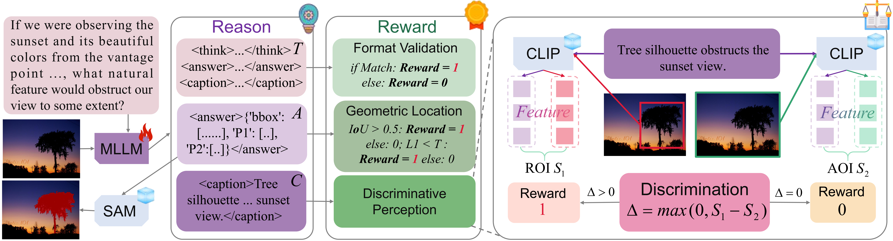

<h2 align="center">Discriminative Perception via Anchored Description for Reasoning Segmentation</h2>

<p align="center"><b>CVPR 2026</b> | <a href="https://arxiv.org/pdf/2603.04002">[Paper]</a> | <a href="https://github.com/mrazhou/DPAD">[Code]</a> </p>


**DPAD** is a reinforcement learning framework for reasoning segmentation that actively cultivates discriminative perception:

- 🎯 **Contrastive Reward**: Anchor-based discrimination.

- 🧠 **Focused Reasoning**: -42% shorter chains.

- 🌱 **High Efficiency**: 3K samples & interpretable.

<p align="center">
  
</p>

### Installation
```bash
git clone https://github.com/mrazhou/DPAD.git
cd DPAD

conda create -n dpad python=3.11
conda activate dpad

pip install torch==2.5.1 torchvision==0.20.1
pip install -e .
pip install sam2 matplotlib
```


### Training


```bash
bash training_scripts/run_qwen2_5_3b_refCOCOg.sh
```

Merge Checkpoint (optional)

```bash
python3 training_scripts/model_merger.py --local_dir [path_to_your_actor_checkpoint]
```

### Evaluation


```bash
bash evaluation_scripts/eval_all.sh [path_to_your_actor_checkpoint]/actor
```

Note: The current code has been organized to some extent. Feel free to open an issue or contact me via email for updates and maintenance.


### Results
<div style="text-align: center;">
    
</div>

### Citation
If you find this repository helpful, please consider citing our paper:
```bibtex
@article{zhou2026DPAD, 
  title={Discriminative Perception via Anchored Description for Reasoning Segmentation}, 
  author={Yang, Tao and Zhou, Qing and Wang, Qi}, 
  journal={CVPR}, 
  year={2026},
}
@article{zhou2026rise, 
  title={Reasoning via Implicit Self-supervised Emergence for Instruction Segmentation}, 
  author={Zhou, Qing and Yang, Lichang and Jia, Yuyu and Gao, Junyu and Ni, Weiping and Wu, Junzheng and Wang, Qi}, 
  volume={40}, 
  number={16}, 
  journal={Proceedings of the AAAI Conference on Artificial Intelligence}, 
  year={2026},
  pages={13746-13754}
}
```
and the Seg-Zero paper:
```bibtex
@article{liu2025segzero,
  title        = {Seg-Zero: Reasoning-Chain Guided  Segmentation via Cognitive Reinforcement},
  author       = {Liu, Yuqi and Peng, Bohao and Zhong, Zhisheng and Yue, Zihao and Lu, Fanbin and Yu, Bei and Jia, Jiaya},
  journal      = {arXiv preprint arXiv:2503.06520},
  year         = {2025}
}
```

### Acknowledgments
Thanks very much to [Seg-Zero](https://github.com/JIA-Lab-research/Seg-Zero), [Qwen2.5-VL](https://huggingface.co/Qwen/Qwen2.5-VL-3B-Instruct) and [SAM2](https://huggingface.co/facebook/sam2-hiera-large) for their great work.
